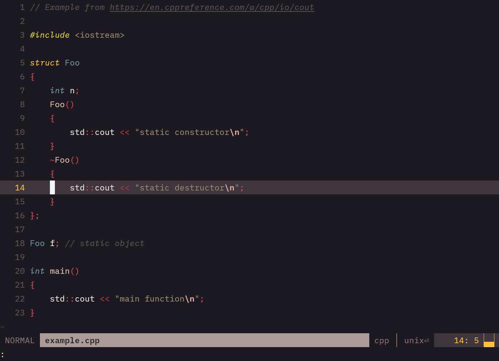
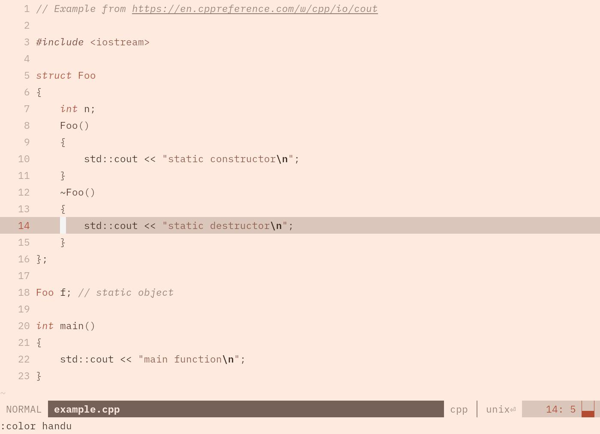
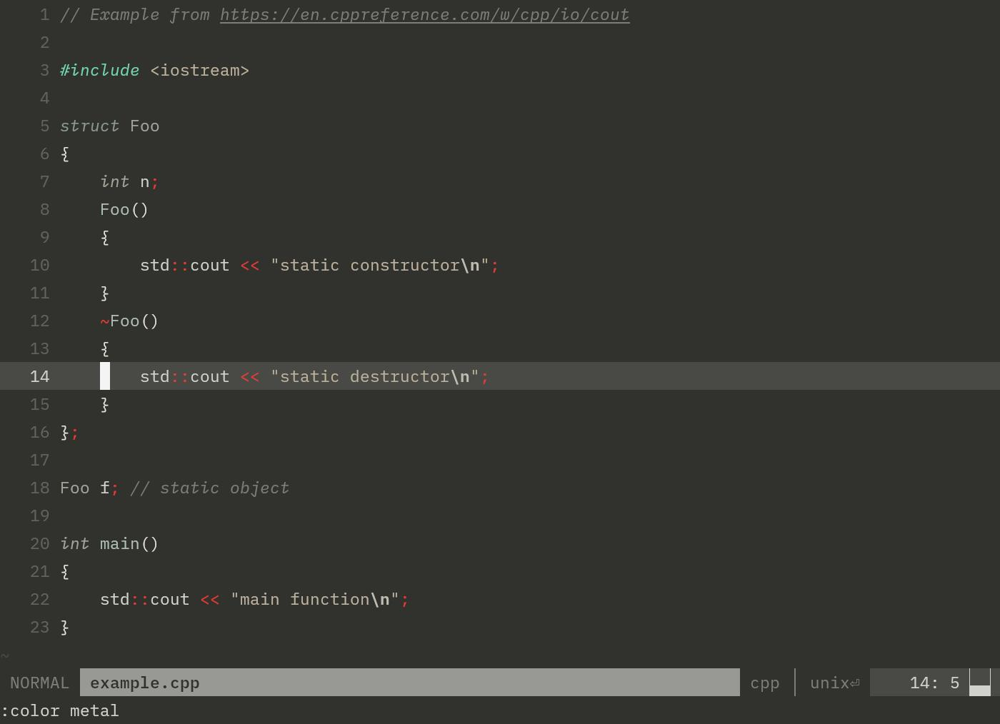
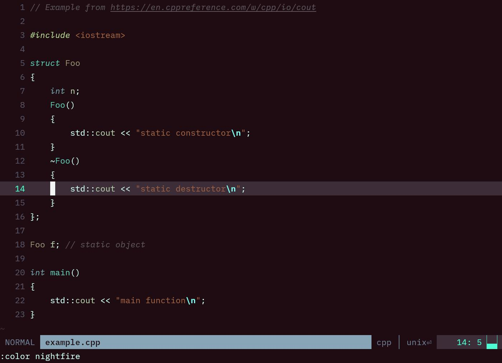
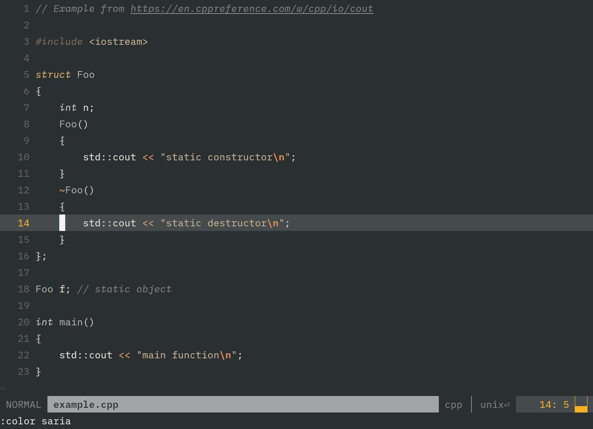
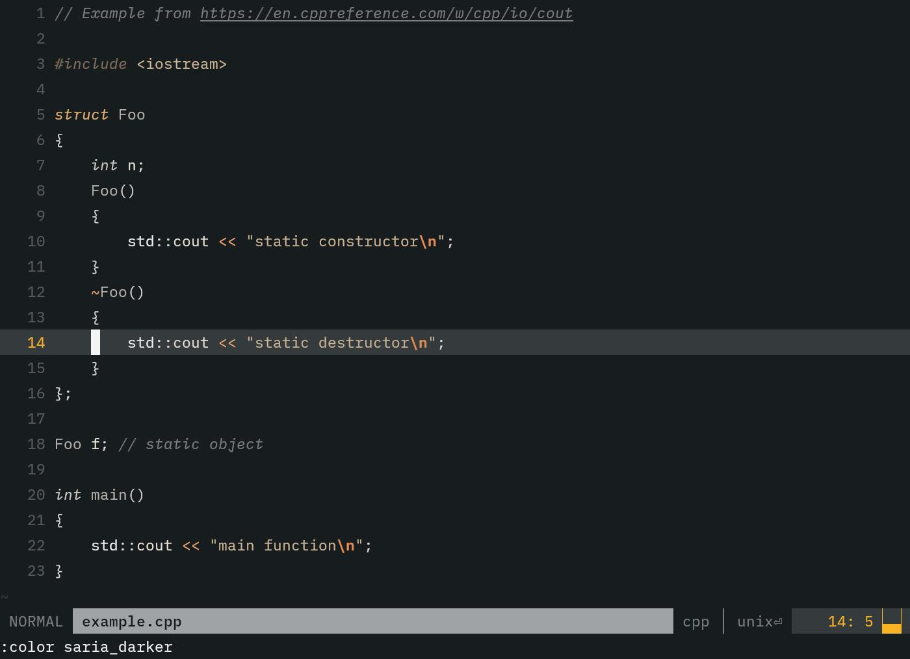

# MY NEOVIM COLORSCHEMES

My personal colorschemes for neovim, using treesitter and lsp for better syntax
highlighting.

While I tried to be as generic as possible to make these look good with most
filetypes, they are tuned for C/C++ since that's what I use most of the time.

Use your preferred plugin manager, or clone and copy the `colors` and `lua` to
a folder in one the paths listed in `runtimepath`.

## Preview

### bosa

### handu

### metal

### nightfire

### saria

### saria_darker

